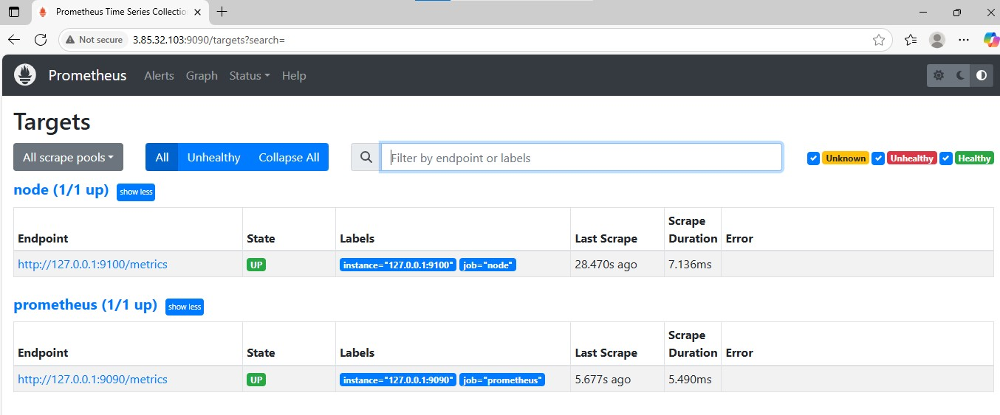
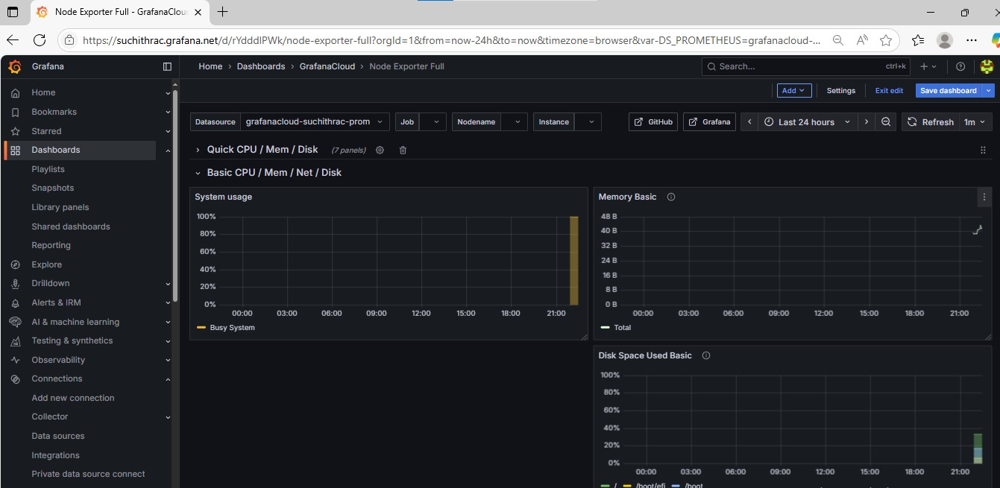

# Prometheus + Grafana Cloud Monitoring

Lightweight monitoring for AWS EC2 t2.micro using Prometheus + Node Exporter locally with Grafana Cloud dashboards

## 1. Features

- **System Metrics**: CPU, Memory, Disk
- **Professional Dashboards**: Grafana Cloud interface
- **Real-time Monitoring**: 30-second metric intervals

## 2. Architecture

```
┌─────────────┐     ┌──────────────┐     ┌─────────────────┐
│ Node        │───▶│ Prometheus    │───▶│ Grafana Cloud   │
│ Exporter    │     │ (Local)      │     │ (Remote)        │
│ :9100       │     │ :9090        │     │ Dashboards      │
└─────────────┘     └──────────────┘     └─────────────────┘
```

## 3. TechStack

- AWS EC2 t2.micro instance
- Ubuntu 22.04
- Grafana Cloud account 

```
# 1. Launch t2.micro with Ubuntu 22.04
# 2. Install monitoring stack
# 3. Configure Grafana Cloud credentials
sudo vi /etc/prometheus/prometheus.yml

# 4. Import dashboard (ID: 1860) in Grafana Cloud
```
## 4. Steps to setup

### i. System Setup
```
sudo apt update && sudo apt install -y wget curl
sudo useradd --no-create-home --shell /bin/false prometheus node_exporter
```

### ii. Install Node Exporter
```
cd /tmp
wget https://github.com/prometheus/node_exporter/releases/download/v1.6.1/node_exporter-1.6.1.linux-amd64.tar.gz
tar xf node_exporter-1.6.1.linux-amd64.tar.gz
sudo cp node_exporter-1.6.1.linux-amd64/node_exporter /usr/local/bin/
```

### iii. Install Prometheus
```
wget https://github.com/prometheus/prometheus/releases/download/v2.47.0/prometheus-2.47.0.linux-amd64.tar.gz
tar xf prometheus-2.47.0.linux-amd64.tar.gz
sudo cp prometheus-2.47.0.linux-amd64/prometheus /usr/local/bin/
```

### iv. Configure Services

### v.  Grafana Cloud Setup

1. Sign up at [grafana.com](https://grafana.com) (free tier)
2. Get remote write credentials from the stack
3. Update `prometheus.yml` with specific credentials
4. Import Node Exporter dashboard (ID: 1860)


## 5.Verification

```
# Check services
sudo systemctl status prometheus node_exporter

# Test metrics
curl http://localhost:9090/api/v1/targets

# Monitor resources
free -h && df -h
```

## 6.Screenshots

### Prometheus - Metric Collection



### Grafana - Visualization




